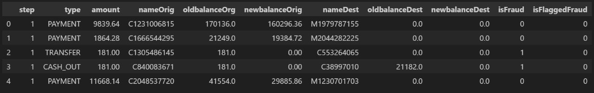
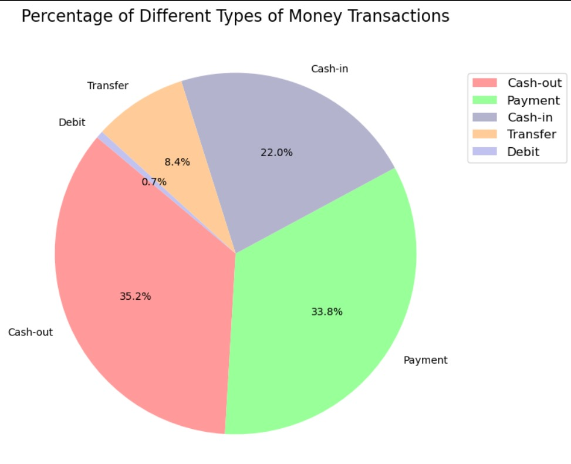
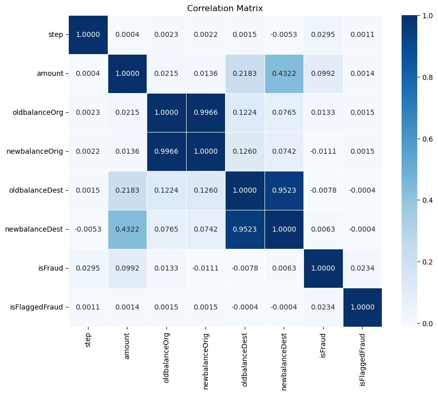

# Fraud Detection in Online Transactions

This repository contains a notebook for detecting fraud in financial transactions using machine learning techniques. The notebook demonstrates various stages of data processing, exploration, and modeling to predict fraudulent transactions.

## Table of Contents

- [Data Exploration and Visualization]
- [Data Cleaning]
- [Feature Engineering]
- [Oversampling]
- [Modeling]
- [Results]

## Data Exploration and Visualization

1. **Loading Data**

   The dataset is loaded using `pandas` and initial exploration is performed to understand its structure, including viewing the first few rows, getting data types, and checking for any missing values.

2. **Visualizing Transaction Types**

   A pie chart is generated to visualize the percentage distribution of different types of transactions. This includes categories such as 'Cash-out', 'Payment', 'Cash-in', 'Transfer', and 'Debit'.

3. **Fraud vs. Non-Fraud Counts**

   A bar plot is created to compare the counts of fraudulent and non-fraudulent transactions, helping to understand the class distribution in the dataset.

## Data Cleaning

1. **Checking for Missing Values**

   The dataset is checked for any missing values, and it was found that there are no missing values.

2. **Removing Outliers**

   Outliers are identified and removed based on Z-scores to ensure that they do not skew the analysis.

3. **Correlation Analysis**

   A heatmap of the correlation matrix is created to identify relationships between features. This helps in understanding which features are correlated and might need to be considered in the modeling phase.

4. **Eliminating Irrelevant Columns**

   Columns that do not impact the dependent variable 'fraud' are removed. Specifically, 'nameOrig' and 'nameDest' are identified as irrelevant and dropped from the dataset.

5. **Converting Categorical Variables**

   The categorical variable 'type' is converted into numeric representation using label encoding.

## Oversampling

To address class imbalance, SMOTE (Synthetic Minority Over-sampling Technique) is used. This involves oversampling the minority class (fraudulent transactions) to achieve a balanced dataset with the majority class count.

## Modeling

1. **Data Splitting and Scaling**

   The dataset is split into training and test sets. Standard scaling is applied to the feature data to ensure that the models perform optimally.

2. **XGBoost Classifier**

   An XGBoost classifier is trained on the scaled training data. The model’s performance is evaluated using the Area under Precision-Recall Curve (AUPRC) score.

3. **Random Forest Classifier**

   A Random Forest classifier is trained in batches to handle large datasets efficiently. The performance is evaluated using the confusion matrix to understand the model’s prediction capabilities.

## Results

The performance of the models is evaluated using metrics such as the confusion matrix and the AUPRC score. These results provide insights into the effectiveness of the models in detecting fraudulent transactions.

